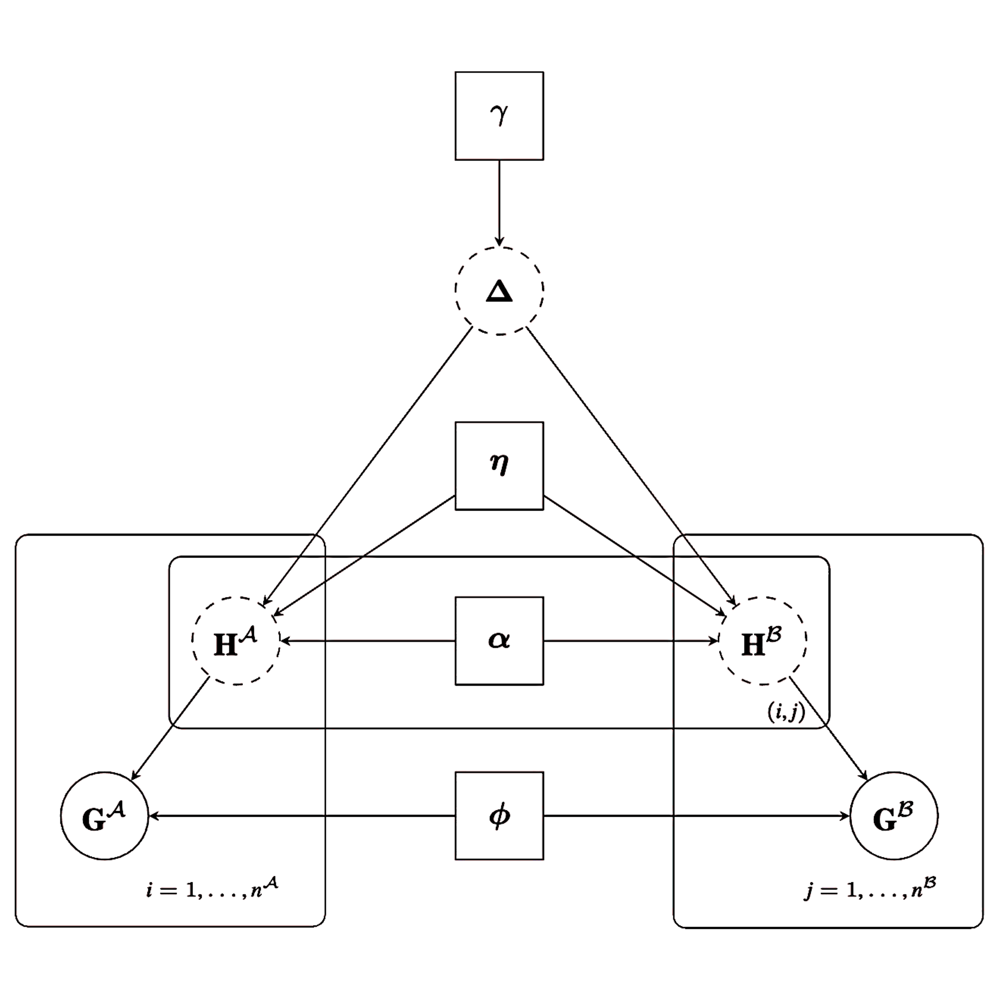
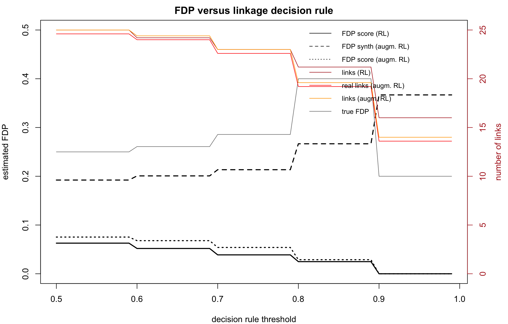
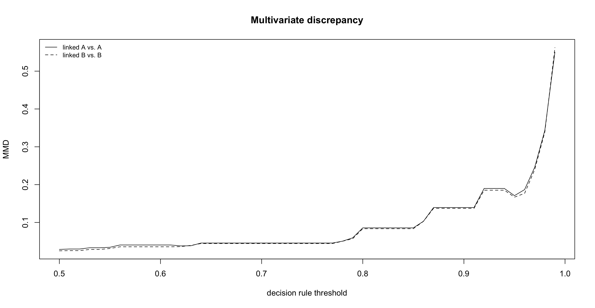
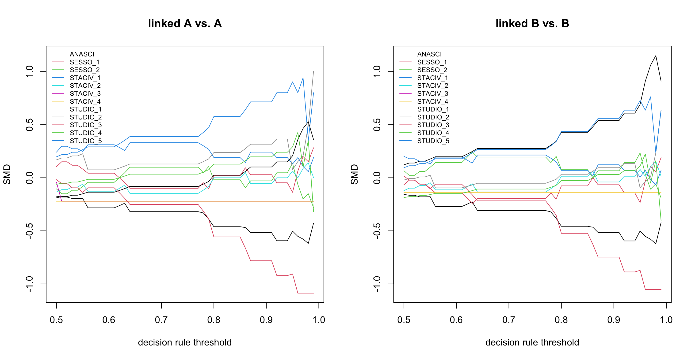
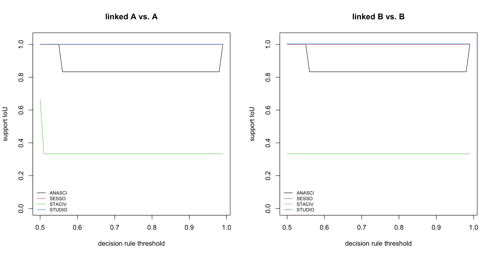
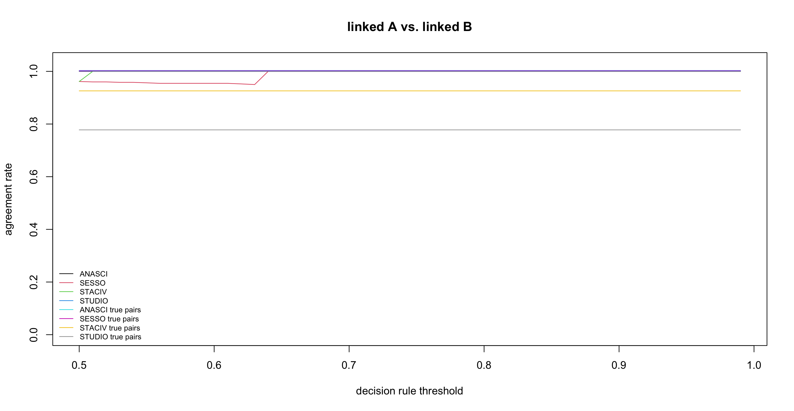
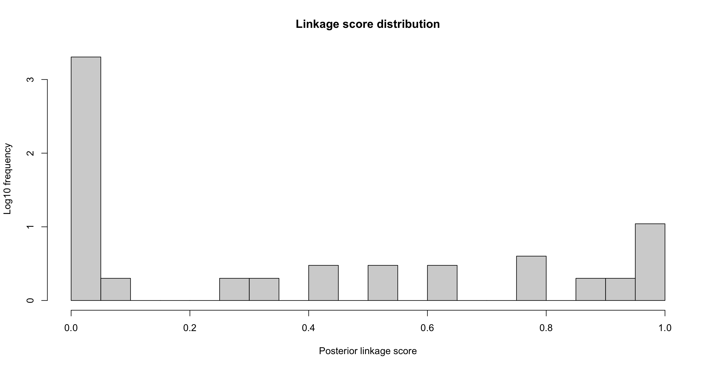
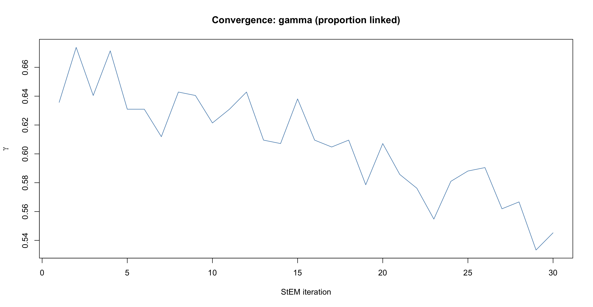
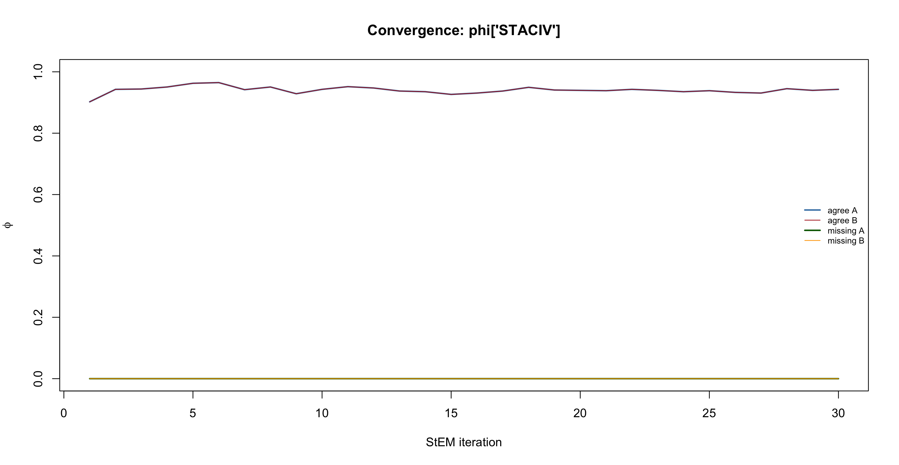

# FlexRL 

<!-- badges: start -->
[](https://CRAN.R-project.org/package=FlexRL)
<!-- badges: end -->

## Overview

**FlexRL** is an open-source R package for **Flexible Record Linkage and inference on linked data**. It links records that refer to the same entity across two data sources sharing no unique identifier but rather partially identifying variables such as birth year, sex, postal code, or product code, brand and category.

The package applies wherever two sources are expected to overlap: health monitoring studies at two time points, survey waves, census and administrative records, or customer and product files from two retailers. It reach real practice by supporting data access, data sharing without unique identifiers, reusing existing data, offering access to broader sets of variables across wider populations and extended time periods.

Without a unique identifier, probabilistic record linkage makes errors, and these errors propagate into the analysis that follows. FlexRL therefore does two things:

1. **It links the sources** with a hierarchical model of how the data were generated, and returns the linked records with their posterior linkage scores.
2. **It makes the quality of the linked data transparent**, with tools that tell you how many of the linked pairs are likely to be false, and how much the linked sample differs from the sources it comes from.

Those tools work on the output of **any** record linkage method, so you can report linkage quality alongside your results even if you did not use FlexRL for linkage.

## 🔬 FlexRL contributions: hierarchical modelling & diagnostics

- A **hierarchical model of the data generation process** for two sources, with one-to-one assignment built in.
- **Dynamic PIVs** that change over time (for example, a postal code between two data collections), modelled with a survival model.
- **Registration errors**, missing values and mistakes, modelled.
- **Linkage quality tools that work with any method**: estimated false discovery proportion, and divergence between the linked sample and the sources, as functions of the decision rule.
- A **low memory footprint**: memory grows with the number of records and candidate pairs, not with the number of all pairs.

Existing record linkage methods reduces every pair of records to a vector of agreements and disagreements and classifies the pairs. FlexRL instead models the data generation process: the registered values are distorted versions of latent true values, and the linkage structure determines which records share the same true values. Parameters estimation of this hierarchical modelling is done with Stochastic Expectation Maximisation (StEM) algorithm.

The model is introduced in:
> *A flexible model for record linkage*
> K. Robach, S.L. van der Pas, M.A. van de Wiel, M.H. Hof
> *Journal of the Royal Statistical Society: Series C*, 2025.
> <https://doi.org/10.1093/jrsssc/qlaf016>

## 🧩 Flexible by design

FlexRL adapts to the data you have, rather than the other way round.

| You want to... | How FlexRL does it |
| --- | --- |
| Link variables that never change (birth year, sex) | Declare the PIV as `"stable"`, optionally bounding its probability of a mistake |
| Link variables that may change but whose registration dates are unknown (marital status, education) | Declare it `"flexible"`: changes are absorbed by the registration error model |
| Link variables that change over time and model the change | Declare it `"structured"`: changes follow a survival model (exponential, Weibull, Gompertz, piecewise constant, or any user-defined model), optionally with covariates |
| Control the registration errors | Bound or fix the probability of a mistake per PIV, and choose whether both sources share the same error parameters (`same_mistakes`) |
| Handle missing values | Missing values are modelled explicitly per PIV and per source, not dropped |
| Get a quick baseline | `naive_linkage()` links records agreeing exactly on all PIVs, to gauge how hard the task is |
| Try methods on simulated data | `simulate_data()` generates two overlapping sources with chosen overlap, error rates and hazards of change |
| Assess another package's linkage | Wrappers for **fastLink, BRL, reclin2, multilink, diyar and fedmatch** feed their output into the same diagnostics |

## 🔍 Inference on linked data

Record linkage is rarely the end of the analysis. A stricter decision rule produces fewer falsely linked pairs, but it also select fewer and more atypical records, and both can bias what you estimate. `RL_diagnostics()` gathers the tools that make this trade-off visible, as a function of the decision rule:

- [**Estimators of the false discovery proportion**](https://doi.org/10.1002/sim.70292) (Robach et al., *Statistics in Medicine*, 2025): one computed from the linkage scores, and one based on synthetic records that does not rely on the linkage model.
- [**Diagnostics of the divergence between the linked sample and the sources**](https://kayanerobach.github.io/blog/2025/causal-record-linkage/) (Robach et al., soon on arXiv, 2026): standardised mean differences, overlap of supports, maximum mean discrepancy, and agreement rates.
- **Convergence and score plots** for the StEM chains and the linkage scores.

You can choose the decision rule so that the estimated false discovery proportion stays below a target, and see what that choice costs in sample size and representativeness.

## 📦 Installation

The released version of FlexRL can be installed from [CRAN](https://CRAN.R-project.org/package=FlexRL):

```r
install.packages("FlexRL")
library(FlexRL)
```

The development version is available from [GitHub](https://github.com/robachowyk/FlexRL), with one of:

```r
pak::pak("robachowyk/FlexRL")
remotes::install_github("robachowyk/FlexRL")
devtools::install_github("robachowyk/FlexRL")
```

FlexRL relies on Rcpp. When installed from GitHub, it may require gfortran and gcc.

## 🚀 Quick start

The example below uses the [Bank of Italy Survey on Household Income and Wealth](https://www.bancaditalia.it/statistiche/tematiche/indagini-famiglie-imprese/bilanci-famiglie/distribuzione-microdati/index.html) (SHIW), whose waves can be linked with a known identifier, so that you can check the linkage against the truth. A small extract is shipped with the package vignettes. 

```r
# Two sources (here: two survey waves)
#   system.file()
df2016 <- read.csv("vignettes/ex-reg-SHIW-16.csv", row.names = 1)
df2020 <- read.csv("vignettes/ex-reg-SHIW-20.csv", row.names = 1)

# Describe each PIV: stable, flexible (may change, change not modelled)
#    or structured (change modelled with a survival model)
PIVs_config <- list(
  ANASCI = list(dynamics = "stable",   bound_mistakes = c(0.10, 0.10), fix_mistakes = c(NA, NA)),
  SESSO  = list(dynamics = "stable",   bound_mistakes = c(0.10, 0.10), fix_mistakes = c(NA, NA)),
  STACIV = list(dynamics = "flexible", bound_mistakes = c(NA, NA),     fix_mistakes = c(NA, NA)),
  STUDIO = list(dynamics = "flexible", bound_mistakes = c(NA, NA),     fix_mistakes = c(NA, NA))
)
PIVs <- names(PIVs_config)

# Encode the PIVs, restrict to the common support, label the smaller source A
prep_data <- prepare_data(df2016, df2020, "2016", "2020", PIVs_config,
                          same_mistakes = TRUE, uniq_id = "ID")

# Gauge the difficulty of the task with exact agreement on all PIVs
naive_fit    <- naive_linkage(PIVs, prep_data$encodedA, prep_data$encodedB)
true_pairs   <- do.call(paste, c(prep_data$true_pairs, list(sep = "_")))
linked_pairs <- do.call(paste, c(naive_fit, list(sep = "_")))
tp <- length(intersect(linked_pairs, true_pairs))
fp <- length(setdiff(linked_pairs, true_pairs))
fn <- length(setdiff(true_pairs, linked_pairs))
sprintf("Linking records on the exact agreement of their PIVs gives a false discovery proportion of %.2f and a sensitivity of %.2f.",
        fp / (tp + fp), tp / (tp + fn))

# Fit the model
fit <- StEM(data = prep_data)

# Linked pairs: row of A (i), row of B (j), linkage score (x).
#    A score above 0.5 guarantees one-to-one assignment.
linked <- fit$Delta[fit$Delta$x > 0.5, ]

# Assess linked data quality
diag <- RL_diagnostics(fit, prep_data$encodedA, prep_data$encodedB, PIVs,
                       list(ANASCI = TRUE, SESSO = FALSE, STACIV = FALSE, STUDIO = FALSE),
                       true_pairs = prep_data$true_pairs, FDP_estimation = TRUE,
                       RL_method = "FlexRL", data = prep_data,
                       maxIter4CV = 3, n_repeats = 5)

print(diag, threshold = 0.75)                  # summary at one specific decision rule
plot(diag, "FDP")                              # estimated false discovery proportion vs threshold
plot(diag, "discrepancy")                      # divergence of the linked sample vs threshold
plot(diag, "scores")                           # linkage scores
plot(diag, "distributions", threshold = 0.75)  # linked versus source data distributions
plot(diag, "convergence")                      # StEM chains
```

<div align="center">
  
  
  
  
  
  
  
  
</div>

### Compare record linkage methodologies

The diagnostics only need the declared linked pairs and, if available, their scores. To assess another package, name it in `RL_method`; the wrapper `link_with_<pkg>()` runs it and returns `idxA`, `idxB` and `LinkScore`.

```r
brl_args <- list(flds = PIVs, types = rep("bi",length(PIVs)))
fit_brl <- link_with_BRL(prep_data$encodedA, prep_data$encodedB, brl_args)
diag_brl <- do.call(RL_diagnostics, 
                       c(list(fit_brl, prep_data$encodedA, prep_data$encodedB,
                       PIVs, PIVs_type, true_pairs = prep_data$true_pairs,
                       FDP_estimation = TRUE, RL_method = "BRL", 
                       maxIter4CV = 1, n_repeats = 2), brl_args))
print(diag_brl, threshold = 0.75)
plot(diag_brl, "FDP")
plot(diag_brl, "discrepancy")
plot(diag_brl, "scores")
plot(diag_brl, "distributions", threshold = 0.75)
```

## 📊 Learn more

- **Vignettes**: step-by-step examples on simulated and real data.
- **Documentation in R**: `?simulate_data`, `?prepare_data`, `?naive_linkage`, `?StEM`, `?RL_diagnostics`.
- **Software article**: <!-- TODO: link when on arXiv --> (Robach et al., 2026).

## 🤝 Contributing

Contributions are welcome! Please [open an issue](https://github.com/robachowyk/FlexRL/issues) to report a bug, make a request, ask for help, or submit a pull request :-)

New survival models for dynamic PIVs and wrappers for other linkage packages are especially easy to add.

For other requests, contact _robachowyk@gmail.com_.

## 📝 How to cite

If you use FlexRL, please cite the software article and the methodological papers:

```bibtex
@article{RLrobachetal25,
  author  = {Robach, Kayan\'e and van der Pas, St\'ephanie L. and van de Wiel, Mark A. and Hof, Michel H.},
  title   = {A flexible model for record linkage},
  journal = {Journal of the Royal Statistical Society Series C: Applied Statistics},
  year    = {2025},
  doi     = {10.1093/jrsssc/qlaf016}
}

```
<!-- TODO: add the software article once on arXiv, and a CITATION file so GitHub shows "Cite this repository" -->