``` r
library(FlexRL)
#> If you are happy with FlexRL, please cite us!  Also, if you are unhappy, please cite us anyway.
```

`FlexRL` is a package proposing flexible probabilistic **R**ecord **L**inkage with diagnostic tools for downstream inference on linked data. The record linkage algorithm `StEM()` uses a **St**ochastic **E**xpectation **M**aximisation approach to combine 2 data sources and outputs the set of records referring to the same entities.

More details on the [record linkage methodology](https://doi.org/10.1093/jrsssc/qlaf016); on the [false discovery proportion estimation](https://doi.org/10.1002/sim.70292); and on the potential risks of downstream inference on linked data (Robach et al., in preparation).

This vignette uses example subsets from the [SHIW](https://www.bancaditalia.it/statistiche/tematiche/indagini-famiglie-imprese/bilanci-famiglie/distribuzione-microdati/index.html) data, from the [NLTCS](https://www.icpsr.umich.edu/web/NACDA/studies/9681/versions/V5) data, and synthetic data to showcase how `FlexRL` works, how `StEM()` adapts to dynamic PIVs, how `RL_diagnostics` may guide downstream inference.

We use 4 **P**artially **I**dentifying **V**ariable**s** to link the records: 2 variables such that `dynamics = "stable"` and 2 variables that may change over time. Among these 2 dynamic PIVs, we will model the changes of one (`dynamics = "structured"`) and we will let the algorithm flexible about the other (`dynamics = "flexible"`).


``` r
PIVs_config <- list( V1 = list(dynamics = "stable",
                               bound_mistakes = c(0.10,0.10),
                               fix_mistakes = c(NA,NA)),
                     V2 = list(dynamics = "stable",
                               bound_mistakes = c(0.10,0.10),
                               fix_mistakes = c(NA,NA)),
                     V3 = list(dynamics = "flexible",
                               bound_mistakes = c(NA,NA),
                               fix_mistakes = c(NA,NA)),
                     V4 = list(dynamics = "structured",
                               bound_mistakes = c(NA,NA),
                               fix_mistakes = c(0.02,0.02),
                               cond_hazard_cov = list(cov1 = c("Xe", "Xf"),
                                                      cov2 = c()))
)
PIVs <- names(PIVs_config)
PIVs_stable <- sapply(PIVs_config, function(x) x$dynamics != "structured")
PIVs_type <- list( V1 = FALSE, V2 = FALSE, V3 = FALSE, V4 = TRUE )
```

With PIVs that evolve over time, when modelling is possible, it is natural to parametrise the probability that underlying true values of the registered data for a pair of linked records coincide using a survival function. It is possible to use an exponential model, whose baseline hazard is constant in time; a Weibull model, whose baseline hazard is monotone in time; a Gompertz model, whose baseline hazard grows or decays exponentially in time; a piecewise-constant model, whose baseline hazard takes one value on each interval defined by given cut points; a custom model, supplied as a survival function `S(X, alpha, times)` together with a number of parameters and their starting values. These models may assume proportional hazards, accelerated failure time, proportional odds, additive hazards, ... If the covariates are categorical, make sure to encode them into dummies and drop one category (an intercept is included automatically). Since only the agreement of the true values at the observed time gap is used, the likelihood is the same for every model, `-sum(Hequal \* log(S) + (1 - Hequal) \* log(1 - S))`, and the parameters are estimated with `stats::nlminb()` at each M-step.


``` r
n_values  <- c(8, 9, 10, 15)
p_mistake <- list(V1 = c(0.02, 0.02), V2 = c(0.02, 0.02),
                  V3 = c(0.02, 0.02), V4 = c(0.02, 0.02))
p_missing <- list(V1 = c(0.005, 0.005), V2 = c(0.005, 0.005),
                  V3 = c(0.005, 0.005), V4 = c(0.005, 0.005))
cond_hazard_params <- list(V1 = c(), V2 = c(), V3 = c(), V4 = log(c(0.7, 0.6, 0.5)))

gen_data <- simulate_data(
  PIVs_config = PIVs_config, n_values = n_values, n_records = c(450, 500), 
  n_links = 400, p_mistake = p_mistake, p_missing = p_missing, 
  cond_hazard_params = cond_hazard_params, enforce_estimability = TRUE,
  model_dynamics = survival_model("exponential")
)
```

We pre-process the data for the record linkage task: remove the records for which the linking variables are outside of the common support, check that PIVs are not strongly associated with each other (which may degrade record linkage performance), map PIV values to natural numbers and encode missing values as 0. The StEM algorithm denotes the smallest source as `A` and the largest as `B`.


``` r
prep_data <- prepare_data(
  data1 = gen_data$data1, data2 = gen_data$data2, label1 = "1", label2 = "2", 
  PIVs_config = PIVs_config, same_mistakes = TRUE, uniq_id = "entity_id",
  restrict_support_intersection = TRUE
)
#> '2' is the larger source, saved as B; '1' saved as A.
```


``` r
head(prep_data$encodedA)
#>   V1 V2 V3 V4 change   date    Xe   Xf local_id entity_id source
#> 1  4  1  6 13  FALSE 0.0070  0.93 2.08        1         1      1
#> 2  7  9  8 12  FALSE 0.0043  2.96 1.95        2         2      1
#> 3  0  8  5 10  FALSE 0.0067 -0.36 2.92        3         3      1
#> 4  5  9  8  6  FALSE 0.0094  2.12 0.54        4         4      1
#> 5  5  8 10 13  FALSE 0.0058  1.47 0.90        5         5      1
#> 6  6  6 10 13  FALSE 0.0072  2.70 0.79        6         6      1
```


``` r
head(prep_data$encodedB)
#>   V1 V2 V3 V4 change   date local_id entity_id source
#> 1  4  1  6 13  FALSE 0.0035        1         1      2
#> 2  7  9  9 12  FALSE 0.0026        2         2      2
#> 3  6  8  5 10  FALSE 0.0015        3         3      2
#> 4  5  9  8  6  FALSE 0.0032        4         4      2
#> 5  5  8 10 13  FALSE 0.0080        5         5      2
#> 6  6  6 10 13  FALSE 0.0061        6         6      2
```

For this example we know the true linkage structure.


``` r
head(prep_data$true_pairs)
#>   1 2
#> 1 1 1
#> 2 2 2
#> 3 3 3
#> 4 4 4
#> 5 5 5
#> 6 6 6
```

The number of unique values per **PIV** gives information on their discriminating power:


``` r
prep_data$n_values
#> V1 V2 V3 V4 
#>  8  9 10 15
```

We gauge how hard the record linkage task is using a naive linkage approach: matching records on exact agreement of identifying information.


``` r
naive_fit <- naive_linkage(PIVs = PIVs, 
                           encodedA = prep_data$encodedA, 
                           encodedB = prep_data$encodedB)

df_results <- data.frame( matrix(NA, nrow = 11, ncol = 0) )
rownames(df_results) <- c("TP              ",
                          "FP              ",
                          "FN              ",
                          "sensitivity     ",
                          "FDP             ",
                          "hat FDP score   ",
                          "hat FDP score*  ",
                          "hat FDP synth*  ",
                          "max SMD         ",
                          "min support IoU ",
                          "max MMD         ")

true_pairs      <- do.call(paste, c(prep_data$true_pairs, list(sep="_")))
linked_pairs    <- do.call(paste, c(naive_fit, list(sep = "_")))
true_positive   <- length( intersect(linked_pairs, true_pairs) ) 
false_positive  <- length( setdiff(linked_pairs, true_pairs) ) 
false_negative  <- length( setdiff(true_pairs, linked_pairs) )
sensitivity     <- true_positive / (true_positive + false_negative) 
fdp             <- false_positive / (true_positive + false_positive) 
df_results[1:5,"Naive     "] <- c(true_positive,false_positive,false_negative,sensitivity,fdp)

df_results
#>                  Naive     
#> TP                   252.00
#> FP                    80.00
#> FN                   148.00
#> sensitivity            0.63
#> FDP                    0.24
#> hat FDP score            NA
#> hat FDP score*           NA
#> hat FDP synth*           NA
#> max SMD                  NA
#> min support IoU          NA
#> max MMD                  NA
```

We run record linkage with `FlexRL`. The `data` should contain encodedA, encodedB, n_values, PIVs_config, same_mistakes. `StEM_iter`, `StEM_burnin` and `gibbs_iter`, `gibbs_burnin` are total number of iterations (including burn-in) and iterations to be discarded as burn-in. If `music_on` the algorithm opens a short tune in the browser when it finishes. You can `save_info_iter` (save environment information at each iteration) to `new_directory`. You can set starting values of the algorithm for parameters gamma and phi with `gamma0`, `phiA0`, `phiB0`, and change the number of samples drawn a posteriori to provide a linkage estimate with `n_post_sample` (set to 1000 as default).


``` r
fit <- StEM(data = prep_data)
```

The missing values and potential mistakes in the registration, the size of the overlapping set of records between the files, the total number of entities in the population, the low discriminative power of PIVs, PIVs potential dynamics across time, PIVs distribution, dependencies among PIVs, are obstacles to the linkage.

The algorithm returns: `Delta`, `gamma`, `eta`, `alpha`, `phi`.


``` r
delta_result <- fit$Delta
delta_result <- delta_result[delta_result$x>0.5, ]

linked_pairs    <- do.call(paste, c(delta_result[,c("i","j")], list(sep = "_")))
true_positive   <- length( intersect(linked_pairs, true_pairs) ) 
false_positive  <- length( setdiff(linked_pairs, true_pairs) ) 
false_negative  <- length( setdiff(true_pairs, linked_pairs) )
sensitivity     <- true_positive / (true_positive + false_negative) 
fdp             <- false_positive / (true_positive + false_positive)  

df_results[1:5,"FlexRL    "] <- c(true_positive,false_positive,false_negative,sensitivity,fdp)

df_results
#>                  Naive      FlexRL    
#> TP                   252.00     289.00
#> FP                    80.00      41.00
#> FN                   148.00     111.00
#> sensitivity            0.63       0.72
#> FDP                    0.24       0.12
#> hat FDP score            NA         NA
#> hat FDP score*           NA         NA
#> hat FDP synth*           NA         NA
#> max SMD                  NA         NA
#> min support IoU          NA         NA
#> max MMD                  NA         NA
```

Let us run record linkage diagnostics:


``` r
diag <- RL_diagnostics(fit = fit, encodedA = prep_data$encodedA, encodedB = prep_data$encodedB,
                      compare_vars = PIVs, vars_type_cont = PIVs_type, PIVs = PIVs, 
                      true_pairs = prep_data$true_pairs, FDP_estimation = TRUE, 
                      RL_method = "FlexRL", data = prep_data,
                      maxIter4CV = 1, n_repeats = 2)

df_results[6,"FlexRL    "] <- diag$FDP_measures$curve$RL_FDP_score[1]
df_results[7,"FlexRL    "] <- diag$FDP_measures$curve$augmRL_FDP_score[1]
df_results[8,"FlexRL    "] <- diag$FDP_measures$curve$augmRL_FDP_synth[1]

smd_idx <- grep("smd", names(diag$discrepancy_measures))
iou_idx <- grep("iou", names(diag$discrepancy_measures))
mmd_idx <- grep("mmd", names(diag$discrepancy_measures))

df_results[9, "FlexRL    "] <- max(diag$discrepancy_measures[1,smd_idx])
df_results[10,"FlexRL    "] <- min(diag$discrepancy_measures[1,iou_idx])
df_results[11,"FlexRL    "] <- max(diag$discrepancy_measures[1,mmd_idx])
```


``` r
diag # default, equivalent to print(diag)
#> <RL_diagnostics>
#> 
#>   Linked pairs  (score > 0.50):  330
#> 
#>   FDP           (true pairs):    0.124
#>   Sensitivity   (true pairs):    0.723
#> 
#>   FDP score estimate (RL task):            min threshold 0.50: FDP ~ 0.108
#>                                                threshold 0.50: FDP ~ 0.108
#>                                            max threshold 0.99: FDP ~ 0.004
#>   FDP score estimate (augmented RL task):  min threshold 0.50: FDP ~ 0.127
#>                                                threshold 0.50: FDP ~ 0.127
#>                                            max threshold 0.99: FDP ~ 0.004
#>   FDP synth estimate (augmented RL task):  min threshold 0.50: FDP ~ 0.243
#>                                                threshold 0.50: FDP ~ 0.243
#>                                            max threshold 0.99: FDP ~ 0.000
#>   The score-based estimator is valid when the linkage model is well calibrated to the data.
#>   The synthetic-data estimator is valid when the augmented task is equivalent to the
#>   original one, which requires links and non-links to have similar distributions; similar
#>   score-based FDP estimates on the original and augmented tasks support this prerequisite.
#> 
#>   Multivariate MMD  (linked A vs. A):  0.0023
#>   Multivariate MMD  (linked B vs. B):  0.0028
#> 
#>   IoU support V1  (linked A vs. A):  1.0000
#>   IoU support V2  (linked A vs. A):  1.0000
#>   IoU support V3  (linked A vs. A):  1.0000
#>   IoU support V4  (linked A vs. A):  1.0000
#>   IoU support V1  (linked B vs. B):  0.8750
#>   IoU support V2  (linked B vs. B):  0.8889
#>   IoU support V3  (linked B vs. B):  1.0000
#>   IoU support V4  (linked B vs. B):  1.0000
#> 
#>   Agreement V1  (linked A vs. linked B):  0.9970
#>   Agreement V2  (linked A vs. linked B):  0.9939
#>   Agreement V3  (linked A vs. linked B):  0.9909
#>   Agreement V4  (linked A vs. linked B):  0.7485
#>   Agreement V1  (true pairs):  0.9600
#>   Agreement V2  (true pairs):  0.9350
#>   Agreement V3  (true pairs):  0.9650
#>   Agreement V4  (true pairs):  0.7075
#> 
#>   SMD V1 values: {1, 6, 7, ...}   (linked A vs. A):  0.0309, 0.0285, -0.0686, ...
#>   SMD V2 values: {3, 6, 9, ...}   (linked A vs. A):  0.0510, 0.0225, -0.0724, ...
#>   SMD V3 values: {7, 8, 10, ...}  (linked A vs. A):  0.0416, -0.0644, 0.0377, ...
#>   SMD V4                          (linked A vs. A):  0.0326
#>   SMD V1 values: {1, 2, 7, ...}  (linked B vs. B):  0.0500, 0.0570, -0.0789, ...
#>   SMD V2 values: {0, 2, 9, ...}  (linked B vs. B):  -0.0447, 0.0486, -0.0838, ...
#>   SMD V3 values: {3, 5, 7, ...}  (linked B vs. B):  -0.0427, 0.0486, 0.0548, ...
#>   SMD V4                         (linked B vs. B):  -0.0345
```


``` r
print(diag, threshold = 0.75)
#> <RL_diagnostics>
#> 
#>   Linked pairs  (score > 0.75):  260
#> 
#>   FDP           (true pairs):    0.038
#>   Sensitivity   (true pairs):    0.625
#> 
#>   FDP score estimate (RL task):            min threshold 0.50: FDP ~ 0.108
#>                                                threshold 0.75: FDP ~ 0.054
#>                                            max threshold 0.99: FDP ~ 0.004
#>   FDP score estimate (augmented RL task):  min threshold 0.50: FDP ~ 0.127
#>                                                threshold 0.75: FDP ~ 0.061
#>                                            max threshold 0.99: FDP ~ 0.004
#>   FDP synth estimate (augmented RL task):  min threshold 0.50: FDP ~ 0.243
#>                                                threshold 0.75: FDP ~ 0.120
#>                                            max threshold 0.99: FDP ~ 0.000
#>   The score-based estimator is valid when the linkage model is well calibrated to the data.
#>   The synthetic-data estimator is valid when the augmented task is equivalent to the
#>   original one, which requires links and non-links to have similar distributions; similar
#>   score-based FDP estimates on the original and augmented tasks support this prerequisite.
#> 
#>   Multivariate MMD  (linked A vs. A):  0.0072
#>   Multivariate MMD  (linked B vs. B):  0.0079
#> 
#>   IoU support V1  (linked A vs. A):  1.0000
#>   IoU support V2  (linked A vs. A):  1.0000
#>   IoU support V3  (linked A vs. A):  1.0000
#>   IoU support V4  (linked A vs. A):  1.0000
#>   IoU support V1  (linked B vs. B):  0.8750
#>   IoU support V2  (linked B vs. B):  0.8889
#>   IoU support V3  (linked B vs. B):  0.9000
#>   IoU support V4  (linked B vs. B):  1.0000
#> 
#>   Agreement V1  (linked A vs. linked B):  0.9962
#>   Agreement V2  (linked A vs. linked B):  0.9962
#>   Agreement V3  (linked A vs. linked B):  0.9962
#>   Agreement V4  (linked A vs. linked B):  0.8231
#>   Agreement V1  (true pairs):  0.9600
#>   Agreement V2  (true pairs):  0.9350
#>   Agreement V3  (true pairs):  0.9650
#>   Agreement V4  (true pairs):  0.7075
#> 
#>   SMD V1 values: {1, 2, 7, ...}   (linked A vs. A):  0.0767, 0.0620, -0.1027, ...
#>   SMD V2 values: {2, 3, 9, ...}   (linked A vs. A):  0.0932, 0.1314, -0.1733, ...
#>   SMD V3 values: {3, 7, 10, ...}  (linked A vs. A):  -0.0850, 0.0674, 0.0646, ...
#>   SMD V4                          (linked A vs. A):  0.0207
#>   SMD V1 values: {1, 2, 7, ...}  (linked B vs. B):  0.0973, 0.0937, -0.1127, ...
#>   SMD V2 values: {2, 3, 9, ...}  (linked B vs. B):  0.1234, 0.0998, -0.1815, ...
#>   SMD V3 values: {0, 3, 7, ...}  (linked B vs. B):  -0.0633, -0.1221, 0.0812, ...
#>   SMD V4                         (linked B vs. B):  0.0289
```

These summaries provide information on the linked data. We can also look at: the convergence of the StEM algorithm parameters, the linkage scores distribution, the data distributions between linked subset and original data sources, the divergence metrics of the linked data from the data sources, the FDP estimation.


``` r
plot(diag, "convergence")
```

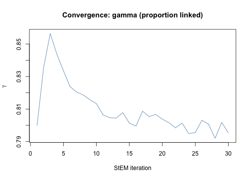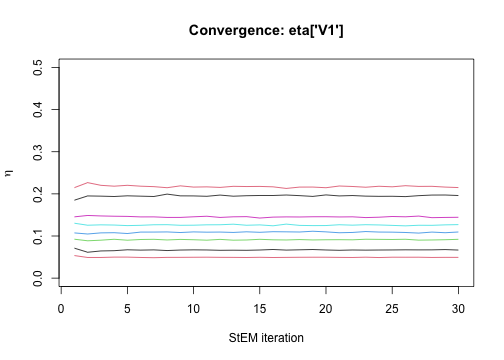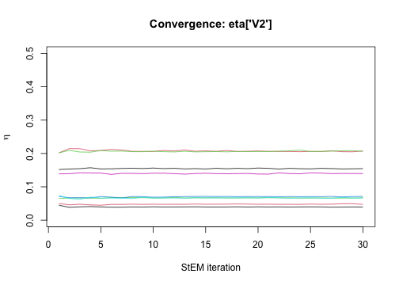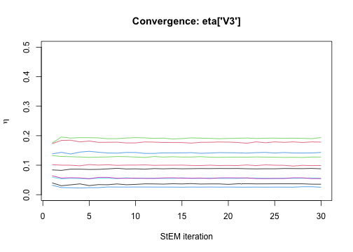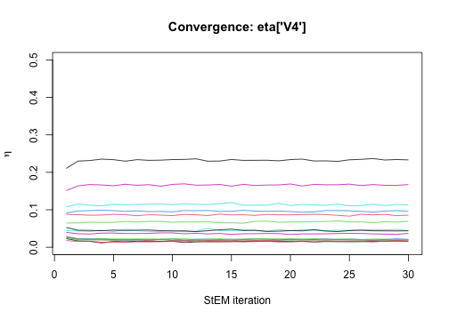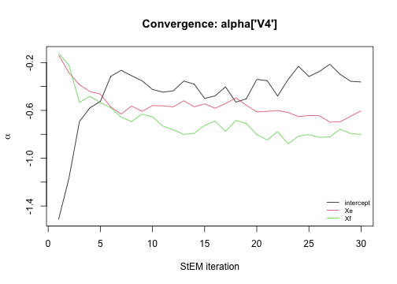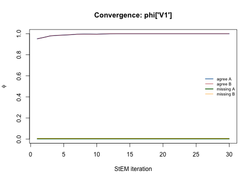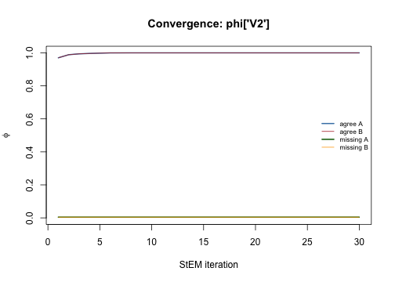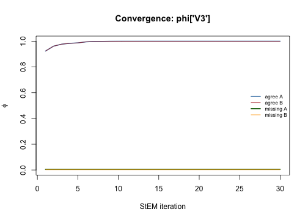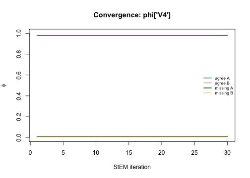

``` r
plot(diag, "scores")
```

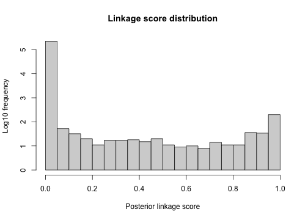

``` r
plot(diag, "distributions", threshold = 0.75)
```

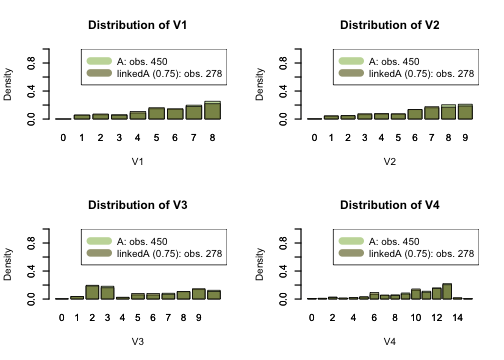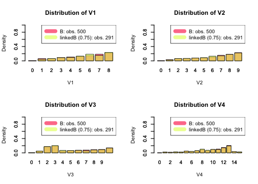

``` r
plot(diag, "discrepancy")
```

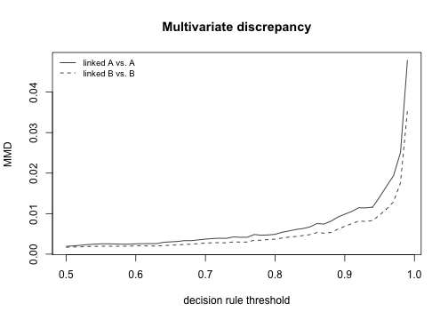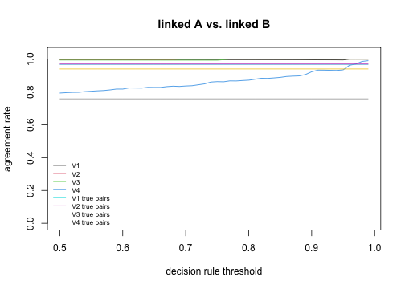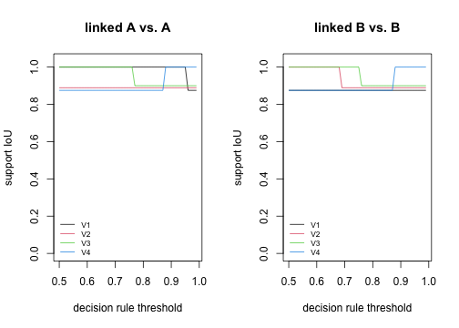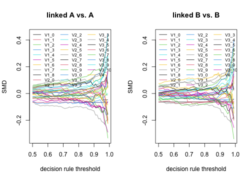

``` r
plot(diag, "FDP")
```

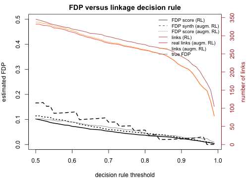

Several other algorithms for **R**ecord **L**inkage have been developed so far in the literature. Each has its own qualities and flaws. `StEM()` usually outperforms in scenarios where the **PIVs** have low discriminative power with few expected registration errors; it is particularly efficient when there is enough information to model the dynamics of some **PIV** changing across time (such as postal code). In 2026, it is the only package taking account of dynamic PIVs. More can be found on this topic in the simulation setting of the [methodology paper](https://doi.org/10.1093/jrsssc/qlaf016), code is provided in [`FlexRL-experiments`](https://github.com/robachowyk/FlexRL-experiments). More can be found on the FDP estimation methods in [this paper](https://doi.org/10.1002/sim.70292).

With `link_with\_\*()` wrappers we can link records with "multilink", "fastLink", "BRL", "reclin2", "diyar", "fedmatch".


``` r
brl_args <- list(flds = PIVs, types = rep("bi",length(PIVs)))
fit_brl <- link_with_BRL(prep_data$encodedA, prep_data$encodedB, brl_args)

delta_result    <- as.data.frame(fit_brl)
delta_result    <- delta_result[delta_result$LinkScore>0.5, ]
linked_pairs    <- do.call(paste, c(delta_result[,c("idxA","idxB")], list(sep = "_")))
true_positive   <- length( intersect(linked_pairs, true_pairs) )
false_positive  <- length( setdiff(linked_pairs, true_pairs) )
false_negative  <- length( setdiff(true_pairs, linked_pairs) )
sensitivity     <- true_positive / (true_positive + false_negative) 
fdp             <- false_positive / (true_positive + false_positive) 

df_results[1:5,"BRL       "] <- c(true_positive,false_positive,false_negative,sensitivity,fdp)

diag_brl <- do.call(RL_diagnostics, c(list(fit_brl, prep_data$encodedA, prep_data$encodedB,
                           PIVs, PIVs_type, PIVs, true_pairs = prep_data$true_pairs,
                           FDP_estimation = TRUE, RL_method = "BRL", maxIter4CV = 1, n_repeats = 2),
                           brl_args))

df_results[6,"BRL       "] <- diag_brl$FDP_measures$curve$RL_FDP_score[1]
df_results[7,"BRL       "] <- diag_brl$FDP_measures$curve$augmRL_FDP_score[1]
df_results[8,"BRL       "] <- diag_brl$FDP_measures$curve$augmRL_FDP_synth[1]

smd_idx <- grep("smd", names(diag_brl$discrepancy_measures))
iou_idx <- grep("iou", names(diag_brl$discrepancy_measures))
mmd_idx <- grep("mmd", names(diag_brl$discrepancy_measures))

df_results[9, "BRL       "] <- max(diag_brl$discrepancy_measures[1,smd_idx])
df_results[10,"BRL       "] <- min(diag_brl$discrepancy_measures[1,iou_idx])
df_results[11,"BRL       "] <- max(diag_brl$discrepancy_measures[1,mmd_idx])
```


``` r
multilink_args <- list(types = rep("bi",length(PIVs)), breaks = list(V1 = NA, V2 = NA, V3 = NA, V4 = NA),
                       duplicates = c(0,0), n_iter = 500, max_cc_size = 50)
fit_multilink <- link_with_multilink( prep_data$encodedA, prep_data$encodedB, multilink_args)

delta_result    <- as.data.frame(fit_multilink[c("idxA", "idxB")])
linked_pairs    <- do.call(paste, c(delta_result[,c("idxA","idxB")], list(sep = "_")))
true_positive   <- length( intersect(linked_pairs, true_pairs) )
false_positive  <- length( setdiff(linked_pairs, true_pairs) )
false_negative  <- length( setdiff(true_pairs, linked_pairs) )
sensitivity     <- true_positive / (true_positive + false_negative) 
fdp             <- false_positive / (true_positive + false_positive) 

df_results[1:5,"multilink "] <- c(true_positive,false_positive,false_negative,sensitivity,fdp)

diag_multilink <- do.call(RL_diagnostics, c(list(fit_multilink, prep_data$encodedA, prep_data$encodedB,
                                PIVs, PIVs_type, PIVs, true_pairs = prep_data$true_pairs,
                                FDP_estimation = TRUE, RL_method = "multilink", maxIter4CV = 1, n_repeats = 2),
                                multilink_args))

df_results[6,"multilink "] <- diag_multilink$FDP_measures$curve$RL_FDP_score[1]
df_results[7,"multilink "] <- diag_multilink$FDP_measures$curve$augmRL_FDP_score[1]
df_results[8,"multilink "] <- diag_multilink$FDP_measures$curve$augmRL_FDP_synth[1]

smd_idx <- grep("smd", names(diag_multilink$discrepancy_measures))
iou_idx <- grep("iou", names(diag_multilink$discrepancy_measures))
mmd_idx <- grep("mmd", names(diag_multilink$discrepancy_measures))

df_results[9, "multilink "] <- max(diag_multilink$discrepancy_measures[1,smd_idx])
df_results[10,"multilink "] <- min(diag_multilink$discrepancy_measures[1,iou_idx])
df_results[11,"multilink "] <- max(diag_multilink$discrepancy_measures[1,mmd_idx])
```


``` r
fastLink_args <- list(varnames = PIVs, tol.em = 1e-06, threshold.match = 0.5, return.all = TRUE, n.cores = 1 )
fit_fastLink <- link_with_fastLink( prep_data$encodedA, prep_data$encodedB, fastLink_args )

delta_result    <- as.data.frame(fit_fastLink)
delta_result    <- delta_result[delta_result$LinkScore>0.5, ]
linked_pairs    <- do.call(paste, c(delta_result[,c("idxA","idxB")], list(sep = "_")))
true_positive   <- length( intersect(linked_pairs, true_pairs) )
false_positive  <- length( setdiff(linked_pairs, true_pairs) )
false_negative  <- length( setdiff(true_pairs, linked_pairs) )
sensitivity     <- true_positive / (true_positive + false_negative) 
fdp             <- false_positive / (true_positive + false_positive) 

df_results[1:5,"fastLink  "] <- c(true_positive,false_positive,false_negative,sensitivity,fdp)

diag_fastLink <- do.call(RL_diagnostics, c(list(fit_fastLink, prep_data$encodedA, prep_data$encodedB,
                                PIVs, PIVs_type, PIVs, true_pairs = prep_data$true_pairs,
                                FDP_estimation = TRUE, RL_method = "fastLink", maxIter4CV = 1, n_repeats = 2),
                                fastLink_args))

df_results[6,"fastLink  "] <- diag_fastLink$FDP_measures$curve$RL_FDP_score[1]
df_results[7,"fastLink  "] <- diag_fastLink$FDP_measures$curve$augmRL_FDP_score[1]
df_results[8,"fastLink  "] <- diag_fastLink$FDP_measures$curve$augmRL_FDP_synth[1]

smd_idx <- grep("smd", names(diag_fastLink$discrepancy_measures))
iou_idx <- grep("iou", names(diag_fastLink$discrepancy_measures))
mmd_idx <- grep("mmd", names(diag_fastLink$discrepancy_measures))

df_results[9, "fastLink  "] <- max(diag_fastLink$discrepancy_measures[1,smd_idx])
df_results[10,"fastLink  "] <- min(diag_fastLink$discrepancy_measures[1,iou_idx])
df_results[11,"fastLink  "] <- max(diag_fastLink$discrepancy_measures[1,mmd_idx])
```


``` r
reclin2_args <- list(on = PIVs, formula = stats::as.formula(paste("~", paste(PIVs, collapse = "+"))),
                     type = "mpost", add = TRUE, variable = "selected", score = "mpost", threshold = 0.5)
fit_reclin2 <- link_with_reclin2( prep_data$encodedA, prep_data$encodedB, reclin2_args )

delta_result    <- as.data.frame(fit_reclin2)
delta_result    <- delta_result[delta_result$LinkScore>0.5, ]
linked_pairs    <- do.call(paste, c(delta_result[,c("idxA","idxB")], list(sep = "_")))
true_positive   <- length( intersect(linked_pairs, true_pairs) )
false_positive  <- length( setdiff(linked_pairs, true_pairs) )
false_negative  <- length( setdiff(true_pairs, linked_pairs) )
sensitivity     <- true_positive / (true_positive + false_negative) 
fdp             <- false_positive / (true_positive + false_positive) 

df_results[1:5,"reclin2   "] <- c(true_positive,false_positive,false_negative,sensitivity,fdp)

diag_reclin2 <- do.call(RL_diagnostics, c(list(fit_reclin2, prep_data$encodedA, prep_data$encodedB, 
                               PIVs, PIVs_type, PIVs, true_pairs = prep_data$true_pairs, 
                               FDP_estimation = TRUE, RL_method = "reclin2", maxIter4CV = 1, n_repeats = 2),
                               reclin2_args))

df_results[6,"reclin2   "] <- diag_reclin2$FDP_measures$curve$RL_FDP_score[1]
df_results[7,"reclin2   "] <- diag_reclin2$FDP_measures$curve$augmRL_FDP_score[1]
df_results[8,"reclin2   "] <- diag_reclin2$FDP_measures$curve$augmRL_FDP_synth[1]

smd_idx <- grep("smd", names(diag_reclin2$discrepancy_measures))
iou_idx <- grep("iou", names(diag_reclin2$discrepancy_measures))
mmd_idx <- grep("mmd", names(diag_reclin2$discrepancy_measures))

df_results[9, "reclin2   "] <- max(diag_reclin2$discrepancy_measures[1,smd_idx])
df_results[10,"reclin2   "] <- min(diag_reclin2$discrepancy_measures[1,iou_idx])
df_results[11,"reclin2   "] <- max(diag_reclin2$discrepancy_measures[1,mmd_idx])
```


``` r
diyar_args <- list(probabilistic = TRUE, return_weights = TRUE)
fit_diyar <- link_with_diyar(prep_data$encodedA[, PIVs], prep_data$encodedB[, PIVs], diyar_args)

delta_result    <- as.data.frame(fit_diyar[c("idxA", "idxB")])
linked_pairs    <- do.call(paste, c(delta_result[,c("idxA","idxB")], list(sep = "_")))
true_positive   <- length( intersect(linked_pairs, true_pairs) )
false_positive  <- length( setdiff(linked_pairs, true_pairs) )
false_negative  <- length( setdiff(true_pairs, linked_pairs) )
sensitivity     <- true_positive / (true_positive + false_negative) 
fdp             <- false_positive / (true_positive + false_positive) 

df_results[1:5,"diyar     "] <- c(true_positive,false_positive,false_negative,sensitivity,fdp)

names4diag <- c(PIVs, "local_id", "source")
diag_diyar <- do.call(RL_diagnostics, c(list(fit_diyar, 
                             prep_data$encodedA[, names4diag], prep_data$encodedB[, names4diag], 
                             PIVs, PIVs_type, PIVs, true_pairs = prep_data$true_pairs, 
                             FDP_estimation = TRUE, RL_method = "diyar", maxIter4CV = 1, n_repeats = 2),
                             diyar_args))

df_results[6,"diyar     "] <- diag_diyar$FDP_measures$curve$RL_FDP_score[1]
df_results[7,"diyar     "] <- diag_diyar$FDP_measures$curve$augmRL_FDP_score[1]
df_results[8,"diyar     "] <- diag_diyar$FDP_measures$curve$augmRL_FDP_synth[1]

smd_idx <- grep("smd", names(diag_diyar$discrepancy_measures))
iou_idx <- grep("iou", names(diag_diyar$discrepancy_measures))
mmd_idx <- grep("mmd", names(diag_diyar$discrepancy_measures))

df_results[9, "diyar     "] <- max(diag_diyar$discrepancy_measures[1,smd_idx])
df_results[10,"diyar     "] <- min(diag_diyar$discrepancy_measures[1,iou_idx])
df_results[11,"diyar     "] <- max(diag_diyar$discrepancy_measures[1,mmd_idx])
```


``` r
fedmatch_args <- list(by = PIVs, match_type = "multivar", 
                      unique_key_1 = "unique_key_A", unique_key_2 = "unique_key_B",
                      multivar_settings = fedmatch::build_multivar_settings(
                        compare_type = rep("indicator", length(PIVs)),
                        wgts = rep(1/length(PIVs), length(PIVs))))
fit_fedmatch <- link_with_fedmatch( prep_data$encodedA, prep_data$encodedB, fedmatch_args )

delta_result    <- as.data.frame(fit_fedmatch)
delta_result    <- delta_result[delta_result$LinkScore>0.5, ]
linked_pairs    <- do.call(paste, c(delta_result[,c("idxA","idxB")], list(sep = "_")))
true_positive   <- length( intersect(linked_pairs, true_pairs) )
false_positive  <- length( setdiff(linked_pairs, true_pairs) )
false_negative  <- length( setdiff(true_pairs, linked_pairs) )
sensitivity     <- true_positive / (true_positive + false_negative) 
fdp             <- false_positive / (true_positive + false_positive) 

df_results[1:5,"fedmatch  "] <- c(true_positive,false_positive,false_negative,sensitivity,fdp)

diag_fedmatch <- do.call(RL_diagnostics, c(list(fit_fedmatch, prep_data$encodedA, prep_data$encodedB, 
                               PIVs, PIVs_type, PIVs, true_pairs = prep_data$true_pairs, 
                               FDP_estimation = TRUE, RL_method = "fedmatch", maxIter4CV = 1, n_repeats = 2),
                               fedmatch_args))

df_results[6,"fedmatch  "] <- diag_fedmatch$FDP_measures$curve$RL_FDP_score[1]
df_results[7,"fedmatch  "] <- diag_fedmatch$FDP_measures$curve$augmRL_FDP_score[1]
df_results[8,"fedmatch  "] <- diag_fedmatch$FDP_measures$curve$augmRL_FDP_synth[1]

smd_idx <- grep("smd", names(diag_fedmatch$discrepancy_measures))
iou_idx <- grep("iou", names(diag_fedmatch$discrepancy_measures))
mmd_idx <- grep("mmd", names(diag_fedmatch$discrepancy_measures))

df_results[9, "fedmatch  "] <- max(diag_fedmatch$discrepancy_measures[1,smd_idx])
df_results[10,"fedmatch  "] <- min(diag_fedmatch$discrepancy_measures[1,iou_idx])
df_results[11,"fedmatch  "] <- max(diag_fedmatch$discrepancy_measures[1,mmd_idx])
```


``` r
cat("Record Linkage ")
#> Record Linkage
df_results[1:5,]
#>                            Naive                FlexRL               BRL       
#> TP               252.0000000000000000 289.0000000000000000 251.0000000000000000
#> FP                80.0000000000000000  41.0000000000000000  29.0000000000000000
#> FN               148.0000000000000000 111.0000000000000000 149.0000000000000000
#> sensitivity        0.6300000000000000   0.7225000000000000   0.6274999999999999
#> FDP                0.2409638554216867   0.1242424242424242   0.1035714285714286
#>                            multilink            fastLink            reclin2   
#> TP               256.0000000000000000 224.0000000000000000 247.000000000000000
#> FP                35.0000000000000000  44.0000000000000000  72.000000000000000
#> FN               144.0000000000000000 176.0000000000000000 153.000000000000000
#> sensitivity        0.6400000000000000   0.5600000000000001   0.617500000000000
#> FDP                0.1202749140893471   0.1641791044776119   0.225705329153605
#>                             diyar               fedmatch  
#> TP                56.00000000000000000 269.000000000000000
#> FP                 1.00000000000000000 170.000000000000000
#> FN               344.00000000000000000 131.000000000000000
#> sensitivity        0.14000000000000001   0.672500000000000
#> FDP                0.01754385964912281   0.387243735763098
```


``` r
cat("\nFDP estimation ")
#> 
#> FDP estimation
df_results[6:8,]
#>                  Naive              FlexRL             BRL       
#> hat FDP score            NA 0.1082505528527204 0.1536551479566186
#> hat FDP score*           NA 0.1266631815044860 0.1313086863244028
#> hat FDP synth*           NA 0.2427987795418110 0.1859948394495413
#>                          multilink          fastLink           reclin2   
#> hat FDP score                   NaN 0.2310273975188470 0.3027410458975639
#> hat FDP score*                  NaN 0.2381850917934526 0.3154496848261316
#> hat FDP synth*   0.1207365659313964 0.1889667350193666 0.2037617554858934
#>                  diyar               fedmatch  
#> hat FDP score           NaN 0.09738041002277908
#> hat FDP score*          NaN 0.09681093394077445
#> hat FDP synth*            0                 NaN
```


``` r
cat("\nLinked divergence ")
#> 
#> Linked divergence
df_results[9:11,]
#>                  Naive                FlexRL              BRL       
#> max SMD                  NA 0.056991477960729245 0.09823767031745587
#> min support IoU          NA 0.875000000000000000 0.87500000000000000
#> max MMD                  NA 0.002784106132446951 0.00518460771715884
#>                            multilink            fastLink            reclin2   
#> max SMD          0.084815556623603988 0.169534917512512956 0.23885588276112665
#> min support IoU  0.875000000000000000 0.875000000000000000 0.87500000000000000
#> max MMD          0.003494132327310939 0.005899727021323686 0.00925920144947695
#>                           diyar                fedmatch  
#> max SMD          0.80049449237882664 0.128257933686506342
#> min support IoU  0.86666666666666670 0.875000000000000000
#> max MMD          0.07174554916792503 0.004613783032311081
```
